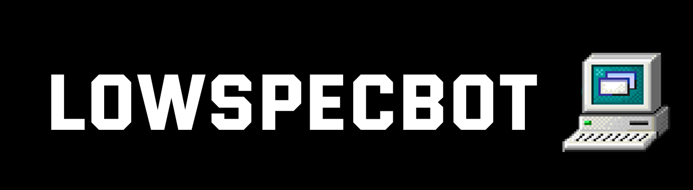

# 📺 LowSpecBot 📺

  
**📖 Description:** Discord Bot whos purpose is to serve at LowSpecGuys Discord Server

## 📚 Made with:

-   Discord API
-   Discord JS (NodeJS)
-   Discord Rich Presence

## 🏅 Features:

-   Modular and expandable commands!
-   Help commands expands as much as the commands do!
-   Settings on a .json file!
-   Kick, ban and soft-ban from a server!
-   Avatar display!
-   Clean spam command!
-   8ball (random phrases)!
-   Mutes & unmutes everyone on a voice channel! (Useful for games such as Among Us!)
-   Text to emoji!

## ❓ How to:

**❗ IMPORTANT NOTE:** The bot will only initialize with the proper token key, so you have to use your **OWN BOT TOKEN** to use this code.

1. Clone repository / Download source code.
2. Make sure you have installed latest NodeJS LTS with npm.
3. Go to the LowSpecBot directory and create a file named `.env` and inside of it, create the environment variable `TOKEN` that will contain **YOUR TOKEN** (remember to use the bot one, since the user one isn't valid.).
4. Execute the following command in your terminal/console (by using cd to the LowSpecBot directory):  
   `npm install`  
   and next:  
   `node .`
5. 🎉 Congratulations! 🎉 The bot is now executing on your machine! 👏👏👏

## 📣 Special Thanks:

**💡 Authors:** [Neutrovertido](https://github.com/Neutrovertido/) & [GASC1211](https://github.com/Gasc1211/)
